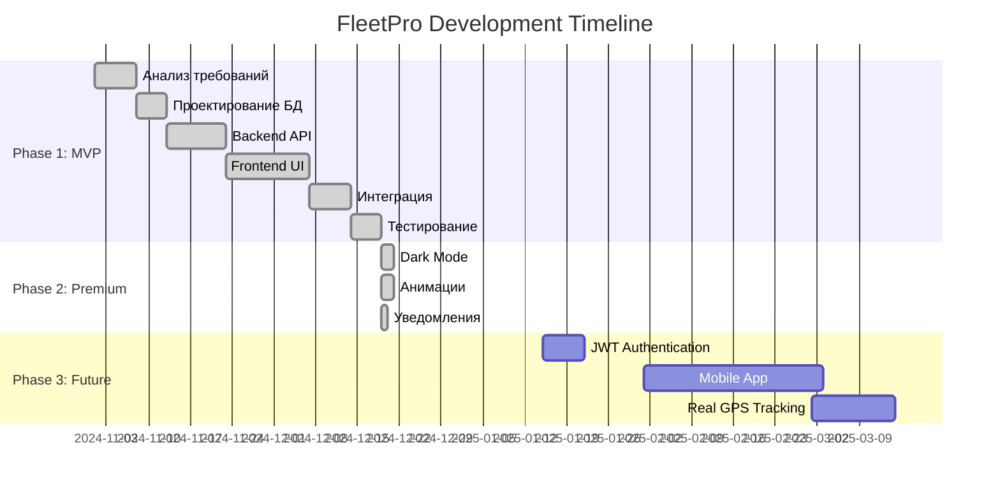

# План развития проекта FleetPro

## 1. Roadmap проекта

### Этапы разработки

| Этап | Описание | Срок | Статус |
|------|----------|------|--------|
| **Phase 1** | MVP — базовый функционал | Ноябрь-Декабрь 2024 | ✅ Завершено |
| **Phase 2** | Premium UI — анимации, темы | Декабрь 2024 | ✅ Завершено |
| **Phase 3** | Production — JWT, мобилка | Q1 2025 | 🔜 Планируется |

---

## 2. Product Backlog

### Приоритизация по MoSCoW

#### Must Have (Обязательно) ✅
- [x] Аутентификация пользователей
- [x] CRUD операции для транспортных средств
- [x] Управление статусами ТС
- [x] Список и детали водителей
- [x] Интерактивная карта
- [x] Базовая финансовая аналитика

#### Should Have (Желательно) ✅
- [x] Dark/Light режим
- [x] Уведомления в реальном времени
- [x] Анимации интерфейса
- [x] Skeleton loading
- [x] Radar chart для водителей

#### Could Have (Можно добавить) 🔜
- [ ] JWT токены вместо сессий
- [ ] Регистрация новых пользователей
- [ ] Добавление новых ТС через UI
- [ ] Экспорт отчётов в PDF
- [ ] Push-уведомления

#### Won't Have (Не в MVP)
- [ ] Мобильное приложение
- [ ] Real-time GPS трекинг
- [ ] Интеграция с ГЛОНАСС
- [ ] Интеграция с топливными картами

---

## 3. Спринт-планирование

### Sprint 1 (Неделя 1-2): Foundation
- ✅ Настройка окружения
- ✅ Создание структуры проекта
- ✅ Схема базы данных
- ✅ Базовый Express сервер

### Sprint 2 (Неделя 3-4): Core API
- ✅ API для vehicles
- ✅ API для drivers
- ✅ API для trips
- ✅ Endpoint авторизации

### Sprint 3 (Неделя 5-6): Frontend
- ✅ React компоненты
- ✅ Tailwind стилизация
- ✅ Интеграция с API
- ✅ Роутинг страниц

### Sprint 4 (Неделя 7): Premium Features
- ✅ Framer Motion анимации
- ✅ Dark Mode
- ✅ Notification Center
- ✅ Recharts графики

### Sprint 5 (Неделя 8): Polish & Docs
- ✅ Документация
- ✅ README.md
- ✅ Техническое задание
- ✅ Unit тесты (базовые)

---

## 4. Анализ рисков

### Технические риски

| Риск | Вероятность | Влияние | Митигация |
|------|-------------|---------|-----------|
| Проблемы с CORS | Средняя | Высокое | Настроен cors middleware |
| Потеря данных БД | Низкая | Высокое | SQLite файл + seed скрипт |
| Медленная загрузка карты | Средняя | Среднее | Lazy loading, кеширование |
| Несовместимость браузеров | Низкая | Среднее | Современный CSS, Autoprefixer |

### Организационные риски

| Риск | Вероятность | Влияние | Митигация |
|------|-------------|---------|-----------|
| Нехватка времени | Высокая | Высокое | Приоритизация по MoSCoW |
| Scope creep | Средняя | Среднее | Чёткое ТЗ, фиксированный MVP |

### Продуктовые риски

| Риск | Вероятность | Влияние | Митигация |
|------|-------------|---------|-----------|
| Неудобный UX | Средняя | Высокое | Итеративные улучшения, анимации |
| Недостаточный функционал | Низкая | Среднее | Обратная связь, расширяемая архитектура |

---

## 5. Definition of Done

Задача считается выполненной, если:
- ✅ Код написан и работает
- ✅ Нет ошибок в консоли
- ✅ UI соответствует макету
- ✅ API возвращает корректные данные
- ✅ Обработаны edge cases
